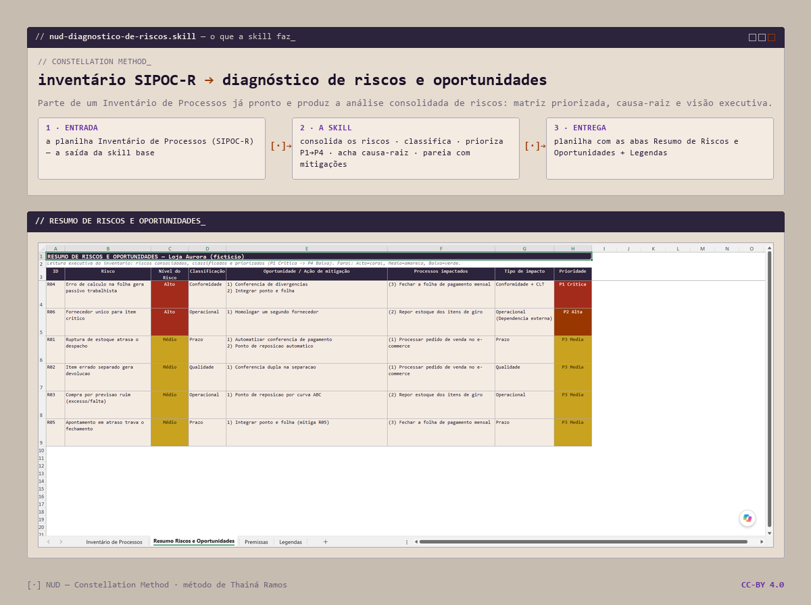

<p align="right"><a href="README.pt-BR.md">🇧🇷 Português</a></p>

<picture>
  <source media="(prefers-color-scheme: dark)" srcset="assets/banner-night.png">
  
</picture>

# nud-diagnostico-de-riscos

[](https://creativecommons.org/licenses/by/4.0/)

This is a **skill I built for Claude** (Anthropic) that starts from a SIPOC-R Process Inventory and produces a **consolidated risk-and-opportunity analysis**: prioritized matrix, pairing with mitigations and an **executive view**. It's the analytical counterpart of **[nud-inventario-processos](https://github.com/whatevertr/skill-whatevertr-inventario-processos)** — I built both for my own process work and use them together.

Part of the **NUD | Constellation Method**, by Thainá Ramos.

> **How I use it & compatibility:** I package it as a **Claude Skill** (Anthropic's Agent Skills format, so it triggers on its own in Claude Code / claude.ai). It's **designed to be model-agnostic** — the method is just `SKILL.md` + `references/`, so I also paste it as context into other chat LLMs, and `builder.py` is plain Python. Everything needed to install and run is in this repo, and I keep improving that so it's easy to pick up.
>
> **On evidence, honestly:** what I can vouch for is my own use — it works for me. You can reproduce the output yourself from the repo. How well the *method* generalizes beyond my cases is something I'm still learning, and I'd love to hear from you if you test it.

---

## What it does

It covers everything the base skill **nud-inventario-processos** does (building the inventory) and adds:

- **"Risks and Opportunities Summary" tab** — the inventory's risks consolidated, with level, classification, impact type and **action priority**.
- **"Legends" tab** — the criteria for level, classification and priority, **defined according to the process context** (not fixed) and documented in the file itself.
- Clustering and prioritization of the risks.
- Pairing each risk with its matching **opportunity for improvement**.

When you only need the map (without the risk analysis), use the base skill **[nud-inventario-processos](https://github.com/whatevertr/skill-whatevertr-inventario-processos)**.

## Structure

```
nud-diagnostico-de-riscos/
├── SKILL.md                         # skill instructions
├── assets/
│   ├── Modelo_Inventario_Processos.xlsx   # base model the builder seeds from (Phase 5)
│   └── Modelo_Diagnostico_Riscos.xlsx     # example of the full delivery: 4 tabs (Inventory + Summary + Premises + Legends)
├── references/                      # technique, mapping, inference, builder, risk summary, legends
└── scripts/
    └── builder.py
```

## Install

Copy the `nud-diagnostico-de-riscos/` folder into your Claude skills directory (`.claude/skills/`) and the skill starts triggering on the cues described in `SKILL.md`.

## Example

`Modelo_Diagnostico_Riscos.xlsx` ships a fictional example — **"Loja Aurora"** — with the four tabs filled in, so you can see the full delivery (Inventory + **Risks and Opportunities Summary** + Premises + **Legends**) before running it with your own inventory.

## License

[CC-BY-4.0](LICENSE). Free to use, with attribution.

---

*NUD (Constellation Method) — a method by Thainá Ramos (Nud by Whatevertr) · <https://github.com/whatevertr> · Licensed under CC-BY-4.0.*
